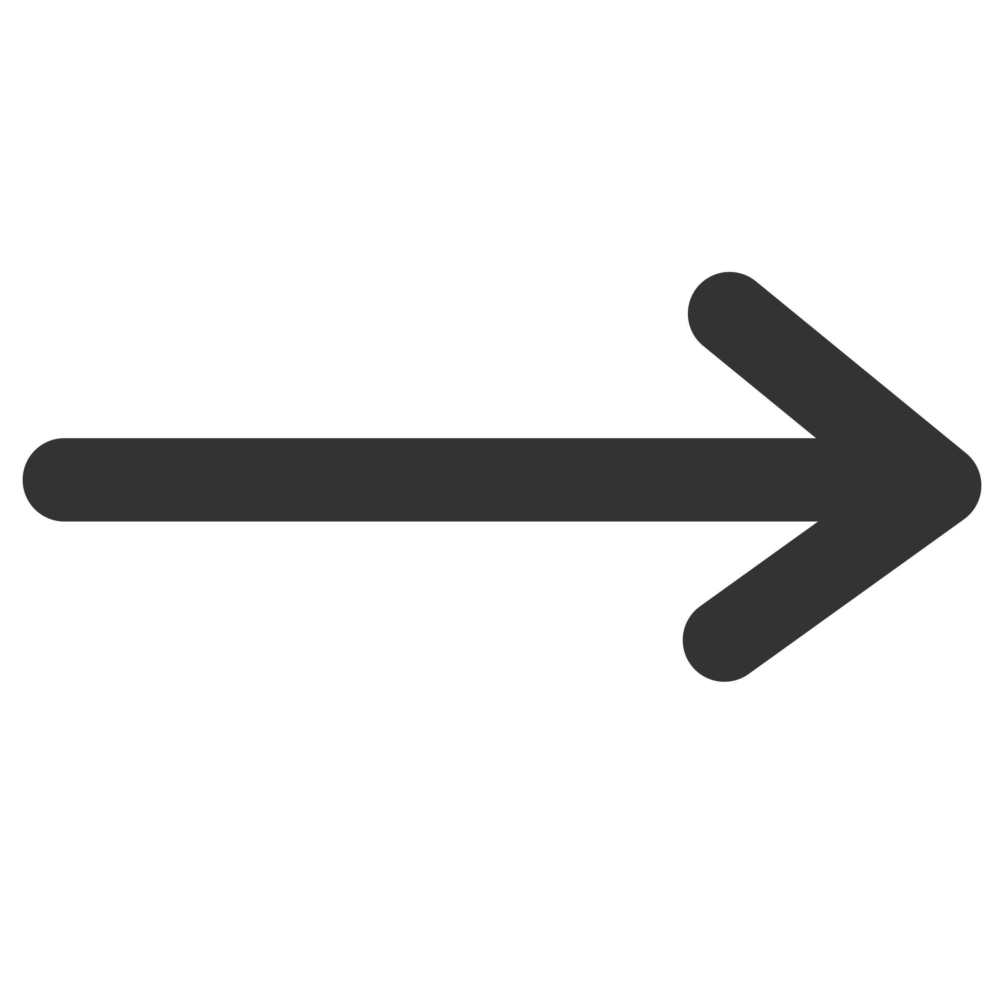

AFQ Tractometry Pipeline
~~~~~~~~~~~~~~~~~~~~
.. include:: <isonum.txt>

.. todo::
  include tractometry pipeline process flow diagram. create and link detail
  paged that elaborates on the process and each step within.

.. .. list-table:: AFQ Tractometry Pipeline
..    :widths: auto

..    * - Tractography
..      - |rArr| `Registration <http://yeatmanlab.github.io/pyAFQ/autoapi/AFQ/registration/index.html>`_
..      - |rArr| `Segmentation <http://yeatmanlab.github.io/pyAFQ/autoapi/AFQ/segmentation/index.html>`_
..      - |rArr| `Cleaning <http://yeatmanlab.github.io/pyAFQ/autoapi/AFQ/segmentation/index.html#AFQ.segmentation.clean_bundles>`_
..      - |rArr| `Profiling <https://dipy.org/documentation/1.4.0./reference/dipy.stats/#afq-profile>`_
..      - |rArr| `Visualization <http://yeatmanlab.github.io/pyAFQ/autoapi/AFQ/viz/index.html>`_

.. figure:: docs/source/explanations/_static/tract_tractography.png
   :figclass: top-image
   :target: docs/source/explanations/tractography.rst

   `1. Registration <http://yeatmanlab.github.io/pyAFQ/autoapi/AFQ/registration/index.html>`_

.. figure:: docs/source/explanations/_static/tract_modeling.png
   :figclass: top-image
   :target: docs/source/explanations/modeling.rst

   `2. Segmentation <http://yeatmanlab.github.io/pyAFQ/autoapi/AFQ/segmentation/index.html>`_

.. figure:: docs/source/explanations/_static/tract_buncle_recognition.png
   :figclass: top-image
   :target: docs/source/explanations/bundle_recognition.rst

   `3. Refinement <http://yeatmanlab.github.io/pyAFQ/autoapi/AFQ/segmentation/index.html#AFQ.segmentation.clean_bundles>`_

.. figure:: docs/source/explanations/_static/tract_cleaning.png
   :figclass: bottom-image
   :target: docs/source/explanations/cleaning.rst

   `4. Cleaning <http://yeatmanlab.github.io/pyAFQ/autoapi/AFQ/viz/index.html>`_

.. figure:: docs/source/explanations/_static/tract_profiling.png
   :figclass: bottom-image
   :target: docs/source/explanations/tract_profiles.rst

   `5. Profiling <https://dipy.org/documentation/1.4.0./reference/dipy.stats/#afq-profile>`_

.. figure:: docs/source/explanations/_static/tract_visualization.png
   :figclass: bottom-image
   :target: docs/source/explanations/visualization.rst

   `6. Visualization <http://yeatmanlab.github.io/pyAFQ/autoapi/AFQ/viz/index.html>`_

