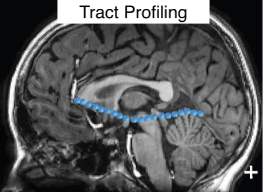

AFQ Tractometry Pipeline
~~~~~~~~~~~~~~~~~~~~
.. include:: <isonum.txt>

.. todo::
  include tractometry pipeline process flow diagram. create and link detail
  paged that elaborates on the process and each step within.

.. .. list-table:: AFQ Tractometry Pipeline
..    :widths: auto

..    * - Tractography
..      - |rArr| `Registration <http://yeatmanlab.github.io/pyAFQ/autoapi/AFQ/registration/index.html>`_
..      - |rArr| `Segmentation <http://yeatmanlab.github.io/pyAFQ/autoapi/AFQ/segmentation/index.html>`_
..      - |rArr| `Cleaning <http://yeatmanlab.github.io/pyAFQ/autoapi/AFQ/segmentation/index.html#AFQ.segmentation.clean_bundles>`_
..      - |rArr| `Profiling <https://dipy.org/documentation/1.4.0./reference/dipy.stats/#afq-profile>`_
..      - |rArr| `Visualization <http://yeatmanlab.github.io/pyAFQ/autoapi/AFQ/viz/index.html>`_

.. figure:: _static/tract_registration.png
   :figclass: top-image
   :target: http://yeatmanlab.github.io/pyAFQ/autoapi/AFQ/registration/index.html

   `1. Registration <http://yeatmanlab.github.io/pyAFQ/autoapi/AFQ/registration/index.html>`_

.. figure:: _static/right_arrow.png
   :figclass: right-arrow

.. figure:: _static/tract_segmentation.png
   :figclass: top-image
   :target: http://yeatmanlab.github.io/pyAFQ/autoapi/AFQ/segmentation/index.html

   `2. Segmentation <http://yeatmanlab.github.io/pyAFQ/autoapi/AFQ/segmentation/index.html>`_

.. figure:: _static/right_arrow.png
   :figclass: right-arrow

.. figure:: _static/tract_cleaning.png
   :figclass: top-image
   :target: http://yeatmanlab.github.io/pyAFQ/autoapi/AFQ/segmentation/index.html#AFQ.segmentation.clean_bundles

   `3. Cleaning <http://yeatmanlab.github.io/pyAFQ/autoapi/AFQ/segmentation/index.html#AFQ.segmentation.clean_bundles>`_

   `4. Profiling <https://dipy.org/documentation/1.4.0./reference/dipy.stats/#afq-profile>`_

.. figure:: _static/left_arrow.png
   :figclass: left-arrow

.. figure:: _static/tract_visualization.png
   :figclass: bottom-image
   :target: http://yeatmanlab.github.io/pyAFQ/autoapi/AFQ/viz/index.html

   `5. Visualization <http://yeatmanlab.github.io/pyAFQ/autoapi/AFQ/viz/index.html>`_

