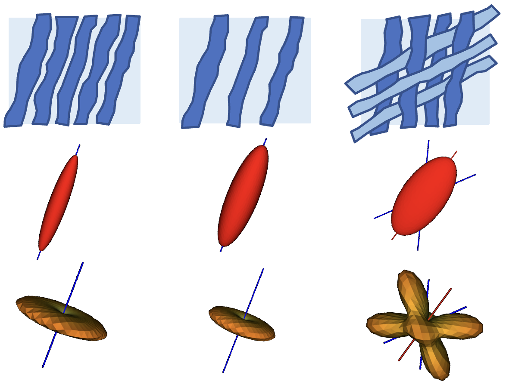
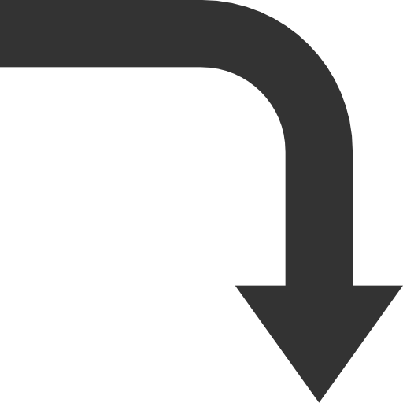
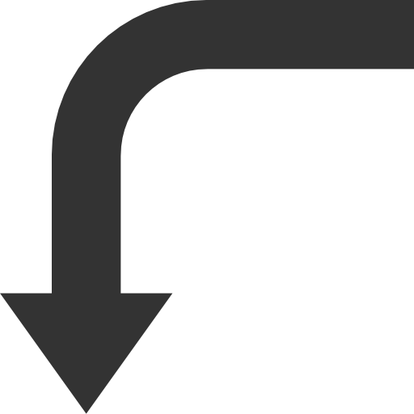

AFQ Tractometry Pipeline
~~~~~~~~~~~~~~~~~~~~~~~~
.. .. |logomo| figure:: _static/tract_modeling2.png
..    :figclass: top-image
..    :target: modeling.html
..    :width: 30%
..    :ref:`modeling`

.. .. |logora| figure:: _static/right_arrow.png
..    :figclass: right-arrow
..    :width: 30%

.. .. |logotr| figure:: _static/tract_tractography.png
..    :figclass: top-image
..    :target: tractography.html
..    :width: 30%
..    :ref:`tractography`

.. .. |logoda| image:: _static/down_arrow.png
..    :width: 30%

.. .. |logore| figure:: _static/tract_recognition.png
..    :figclass: bottom-image
..    :target: recognition.html
..    :width: 40%
..    :ref:`recognition`

.. .. |logola| figure:: _static/left_arrow.png
..    :figclass: left-arrow
..    :width: 10%

.. .. |logopr| figure:: _static/tract_visualization.png
..    :figclass: bottom-image
..    :width: 40%
..    :target: profiling.html
..    :ref:`profiling`

.. +----------+----------+----------+
.. | |logomo| | |logora| | |logotr| |
.. +----------+----------+----------+
.. |          |          | |logoda| |
.. +----------+----------+----------+
.. | |logore| | |logola| | |logopr| |
.. +----------+----------+----------+

.. image:: _static/tract_tractography.png
          :target: tractography.html
          :align: right
          :width: 50%

.. image:: _static/tract_recognition.png
          :target: recognition.html
          :align: left
          :width: 50%

.. image:: _static/tract_profiling.png
          :width: 50%
          :target: profiling.html
          :align: right

.. .. list-table:: simple image grid
..    :class: borderless

..    * - .. image:: _static/tract_modeling2.png
..           :target: modeling.html
..           :align: left
..           :width: 20%
..      - .. image:: _static/right_arrow.png
..           :align: middle
..           :width: 10%
..      - .. image:: _static/tract_tractography.png
..           :target: tractography.html
..           :align: right
..           :width: 20%
..    * - 
..      - 
..      - .. image:: _static/down_arrow.png
..           :width: 10%
..    * - .. image:: _static/tract_recognition.png
..           :target: recognition.html
..           :width: 20%
..      - .. image:: _static/left_arrow.png
..           :width: 10%
..      - .. image:: _static/tract_visualization.png
..           :width: 20%
..           :target: profiling.html

.. +---------------------------------------------+-------------------------------------+---------------------------------------------+
.. | .. image:: _static/tract_modeling2.png      | .. image:: _static/right_arrow.png  | .. image:: _static/tract_tractography.png   |
.. |    :width: 30%                              |    :width: 30%                      |    :width: 30%                              |
.. |    :target: modeling.html                   |                                     |    :target: tractography.html               |
.. +---------------------------------------------+-------------------------------------+---------------------------------------------+
.. |                                             |                                     | .. image:: _static/down_arrow.png           |
.. |                                             |                                     |    :width: 30%                              |
.. |                                             |                                     |                                             |
.. +---------------------------------------------+-------------------------------------+---------------------------------------------+
.. | .. image:: _static/tract_visualization.png  | .. image:: _static/left_arrow.png   | .. image:: _static/tract_recognition.png    |
.. |    :width: 30%                              |    :width: 30%                      |    :width: 30%                              |
.. |    :target: profiling.html                  |                                     |    :target: recognition.html                |
.. +---------------------------------------------+-------------------------------------+---------------------------------------------+

.. |    :ref:`modeling`                          |                                     |    :ref:`tractography`                      |

.. |    :ref:`profiling`                         |                                     |    :ref:`recognition`                       |
